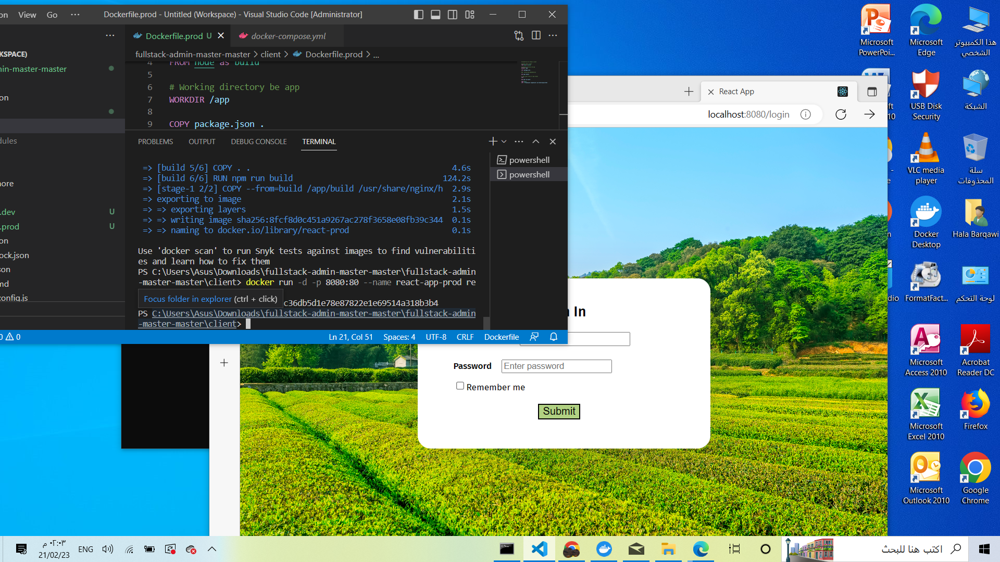

# MERN STACK -Farm managment 

## To run using Docker
- Run using : 
    docker-compose up
    
## In client side (react app) I added a Dockerfile.prod to move from Development to production for that :
- I need to :npm run build ; which create direcrory in project folder called build and within build we have final  static files then used a web server 
nginx to serve these static files. 
- docker build -f Dockerfile.prod -t react-prod . To build the image. 
- docker run -d -p 8080:80 --name react-app-prod react-prod , then localhost:8080

